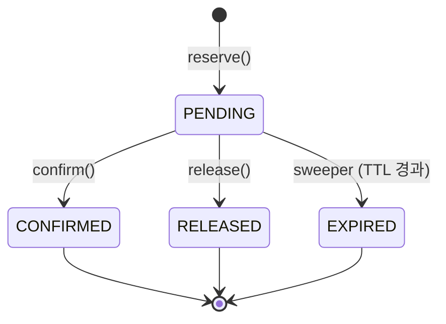

# seojin-stock-reservation

TTL 기반 재고 예약(reservation)과 낙관적 잠금(optimistic locking)으로 동시 주문 상황에서
초과 판매(oversell)를 막는 백엔드 서비스입니다. TypeScript + Hono 로 작성했고,
저장소 계층은 인터페이스와 인메모리(in-memory) 구현으로 분리되어 있어 실제 RDB 구현체로
쉽게 교체할 수 있습니다.

## 왜 만들었나 (문제 정의)

이커머스에서 재고를 다루다 보면 다음 두 요구가 항상 충돌합니다.

- **동시 주문에서 초과 판매가 없어야 한다.** 같은 SKU 를 여러 사용자가 동시에 주문해도
  실제 보유 수량보다 많이 팔리면 안 됩니다.
- **결제 실패·이탈 사용자 때문에 재고가 영원히 묶이면 안 된다.** "장바구니에 담았지만
  결제하지 않은" 주문이 재고를 계속 붙잡고 있으면 다른 사용자가 살 수 있는 재고가
  줄어듭니다.

이 프로젝트는 이 두 요구를 **reserve(선점) → confirm(확정)/release(해제)/expire(자동 만료)**
라는 4단계 흐름과, 재고 레코드에 건 **낙관적 잠금(compare-and-set)** 으로 해결합니다.

## 아키텍처

```
src/
  domain/     상태와 에러 타입 (StockRecord, ReservationRecord, 도메인 예외)
  repository/ 저장소 인터페이스 + 인메모리 구현 (compare-and-set 포함)
  service/    업무 규칙 (ReservationService, ReservationSweeper)
  http/       Hono 라우트, zod 스키마, 에러 -> HTTP 상태 매핑
  index.ts    프로세스 진입점 (서버 기동 + sweeper 시작)
```

계층 간 의존 방향은 `http -> service -> repository(interface) <- repository(in-memory impl)`
입니다. `service` 는 `StockRepository` / `ReservationRepository` **인터페이스**에만
의존하므로, 인메모리 구현을 Postgres/Redis 기반 구현으로 교체해도 `service` 와 `http`
계층은 변경할 필요가 없습니다.

### 재고 모델

재고 레코드는 두 개의 카운터를 갖습니다.

| 필드         | 의미                                                      |
| ------------ | ----------------------------------------------------------|
| `quantity`   | 창고에 실제로 존재하는 on-hand 수량 (확정 판매 시 차감)     |
| `reserved`   | 만료되지 않은 PENDING 예약이 붙잡고 있는 수량               |
| `available`  | `quantity - reserved` (저장하지 않고 항상 계산해서 반환)    |
| `version`    | compare-and-set 에 쓰는 낙관적 잠금 카운터                  |

### 예약 상태 전이



- `reserve`: `available >= quantity` 확인 후 `stock.reserved` 를 늘리고 PENDING 예약을 만든다.
- `confirm`: PENDING 이고 TTL 이 남아 있으면 `stock.quantity` 와 `stock.reserved` 를 함께 줄인다 (실판매 확정).
- `release`: PENDING 이면 `stock.reserved` 만 되돌린다 (`quantity` 는 그대로).
- `expire`: sweeper 가 TTL 이 지난 PENDING 예약을 찾아 `release` 와 동일하게 재고를 회수한다.

## API

모든 응답은 JSON 입니다. 에러 응답은 `{ "error": "<ErrorName>", "message": "..." }` 형태입니다.

| Method | Path                         | 설명                                   | 성공 코드 | 주요 실패 코드                        |
| ------ | ----------------------------- | -------------------------------------- | --------- | --------------------------------------|
| GET    | `/health`                     | 헬스 체크                              | 200       | -                                      |
| POST   | `/stocks`                     | 재고 레코드 생성 `{ sku, quantity }`    | 201       | 400 (검증 실패)                        |
| GET    | `/stocks/:sku`                | 재고 조회                              | 200       | 404 (없음)                             |
| POST   | `/reservations`               | 예약 생성 `{ sku, quantity, ttlMs? }`   | 201       | 400 / 404 / 409 (재고 부족)            |
| GET    | `/reservations/:id`           | 예약 조회                              | 200       | 404                                    |
| POST   | `/reservations/:id/confirm`   | 예약 확정                              | 200       | 404 / 409 (상태 불일치) / 410 (만료)   |
| POST   | `/reservations/:id/release`   | 예약 취소                              | 200       | 404 / 409 (상태 불일치)                |

`ttlMs` 를 생략하면 기본 TTL(5분)이 적용됩니다.

## 동시성 전략과 절충

### 왜 비관적 잠금 대신 낙관적 잠금인가

`SELECT ... FOR UPDATE` 로 재고 행을 잠그는 비관적 잠금은 구현이 단순하지만, 커넥션이
잠금을 쥔 채 대기하는 동안 커넥션 풀을 소모하고, 트래픽이 몰리는 인기 SKU 에서는 요청이
직렬 대기열처럼 쌓여 지연 시간이 눈덩이처럼 불어납니다. 이 프로젝트는 짧은 임계 구역
(재고 확인 + 카운터 증감)에 낙관적 잠금을 사용해 잠금 보유 시간을 없애는 대신, 충돌 시
재시도 비용을 감수하는 쪽을 선택했습니다. 자세한 배경은
[`docs/adr/0001-optimistic-locking-over-pessimistic-locking.md`](docs/adr/0001-optimistic-locking-over-pessimistic-locking.md) 에
정리했습니다.

### compare-and-set + bounded retry

`StockRepository.update()` 와 `ReservationRepository.update()` 는 다음 패턴을 따릅니다.

1. 현재 레코드를 `version` 과 함께 읽는다.
2. `updater` 콜백으로 다음 상태를 계산한다. 이 콜백이 `InsufficientStockError` 같은
   **업무 규칙 위반**을 던지면 재시도 없이 즉시 호출자에게 전파한다.
3. 쓰기 시점에 `version` 이 그대로인지 다시 확인한다(compare-and-set). 그 사이 다른
   트랜잭션이 먼저 썼다면 1번부터 재시도한다.
4. 재시도 횟수가 `maxRetries` 를 넘으면 `ConcurrencyConflictError` 를 던진다.

이 구조 덕분에 "재고가 부족해서 실패"와 "잠깐의 경쟁 때문에 재시도 상한을 넘겨서
실패"를 서로 다른 에러 타입으로 구분할 수 있습니다. 인메모리 구현은 read/write 사이에
의도적으로 비동기 틈(`ioGap`, 마이크로태스크 1틱)을 두어, 실제 DB 왕복에서 벌어지는
"읽은 뒤 다른 트랜잭션이 끼어드는" 상황을 재현합니다 - 이 틈이 없으면 단일 스레드인
Node.js 이벤트 루프 특성상 경쟁 상태 자체가 테스트에서 재현되지 않습니다.

### 재시도 상한을 얼마나 크게 잡을 것인가

**단일 SKU 를 동시에 두고 경쟁하는 요청 수**만큼 재시도가 필요할 수 있다는 점이 OCC
(optimistic concurrency control) 의 구조적 한계입니다 (`test/concurrency.test.ts` 의
200건 동시 요청 테스트가 이를 그대로 보여줍니다 - 마지막으로 성공하는 요청은 앞선 성공
횟수만큼 재시도를 거칩니다). 그래서 `ReservationService` 는 `maxRetries` 를 생성자
옵션으로 받아, 평소 트래픽에는 작은 기본값을, 세일 이벤트처럼 동시성이 극단적으로 몰릴
것으로 예상되는 인기 SKU 에는 더 큰 값을 주입할 수 있게 했습니다. 근본적인 해법은 아니며
`docs/adr/0001-*.md` 의 "한계" 절에 대안을 정리했습니다.

## 실행 방법

```bash
npm install
npm run dev     # http://localhost:3000 에서 API 기동 (핫 리로드)
npm start       # 프로덕션 실행
```

```bash
curl -X POST http://localhost:3000/stocks \
  -H 'content-type: application/json' \
  -d '{"sku":"sku-1","quantity":10}'

curl -X POST http://localhost:3000/reservations \
  -H 'content-type: application/json' \
  -d '{"sku":"sku-1","quantity":2,"ttlMs":60000}'
```

## 테스트

```bash
npm test          # vitest run
npm run typecheck # tsc --noEmit
```

- `test/in-memory-stock-repository.test.ts` - CAS 성공/실패/재시도/예외 전파 단위 테스트
- `test/reservation-service.test.ts` - reserve/confirm/release 업무 규칙 단위 테스트
- `test/concurrency.test.ts` - 단일 SKU 에 200건 동시 예약 → 초과 판매 없음 + 재고 합계 보존 검증
- `test/reservation-sweeper.test.ts` - `vi.useFakeTimers()` 로 시간을 흘려보내며 TTL 만료/멱등성 검증
- `test/app.test.ts` - HTTP 라우트 통합 테스트 (`app.request()`)

## 한계와 향후 과제

- **인메모리 저장소**: 프로세스가 재시작되면 상태가 사라집니다. `StockRepository` /
  `ReservationRepository` 인터페이스를 Postgres(트랜잭션 + `version` 컬럼)나
  Redis(`WATCH`/`MULTI`) 구현으로 교체하는 것을 전제로 설계했습니다.
- **핫 SKU 에서의 OCC 확장성**: 위에서 설명한 대로, 하나의 행에 극단적으로 많은 쓰기가
  몰리면 재시도 횟수가 요청 수에 비례해 늘어납니다. 실서비스라면 (a) 카운터를 여러
  샤드로 쪼개 합산하거나 (Redis `INCR` 기반 샤딩), (b) 알려진 인기 SKU 에 한해 짧은
  시간만 비관적 잠금으로 전환하는 하이브리드 전략을 검토해야 합니다.
- **reserve 와 reservation 레코드 생성 사이의 원자성**: 현재 구현은 `stock.reserved` 증가와
  `ReservationRecord` 생성이 별개의 저장소 호출입니다. 인메모리/단일 프로세스에서는
  안전하지만, 분산 저장소로 옮기면 두 호출 사이에 프로세스가 죽는 경우 재고가 새는(leak)
  경로가 생깁니다. 실제 구현에서는 아웃박스 패턴이나 단일 트랜잭션으로 묶어야 합니다.
- **sweeper 는 단일 프로세스 `setInterval` 로 동작**합니다. 다중 인스턴스로 수평 확장하면
  같은 예약을 여러 인스턴스가 동시에 스윕하려 들 수 있습니다 (동작 자체는 멱등적이라
  안전하지만 중복 작업이 낭비됩니다). 실제 배포에서는 분산 락이나 단일 워커 큐로 옮기는
  것이 낫습니다.
- **인증/인가, 레이트 리밋, 관측성(로그/메트릭)은 범위 밖**입니다. 순수하게 재고 예약
  도메인 로직과 동시성 제어에 집중했습니다.
